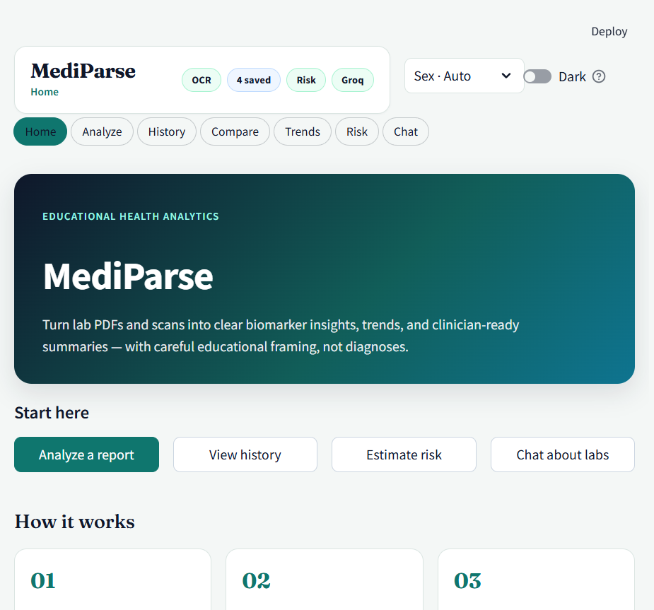
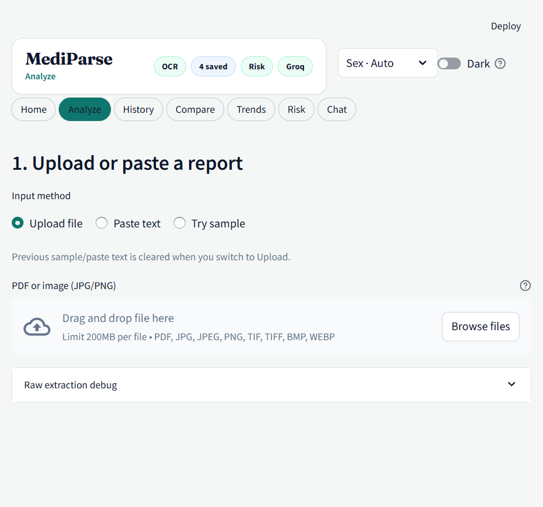
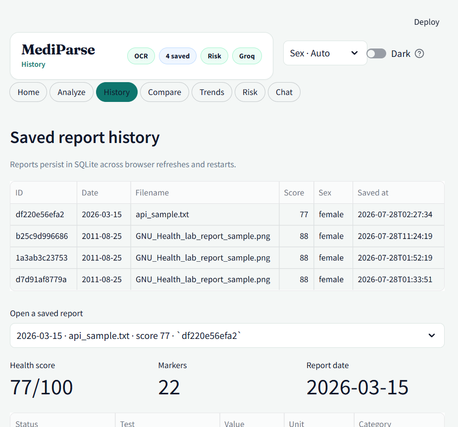
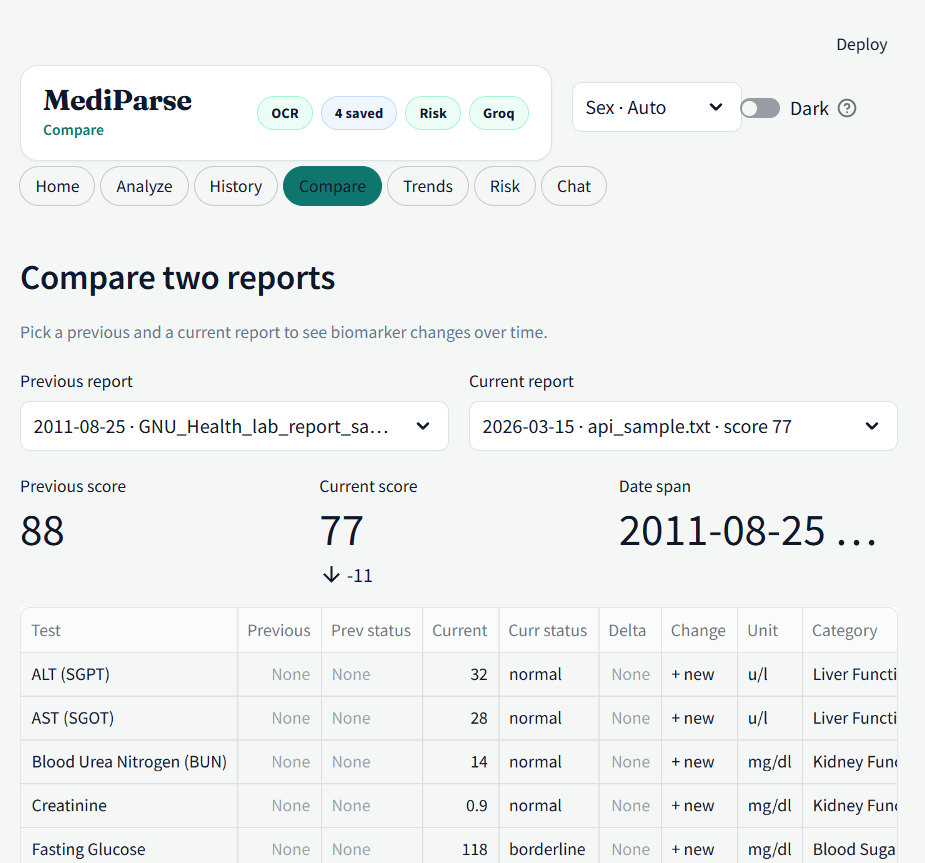
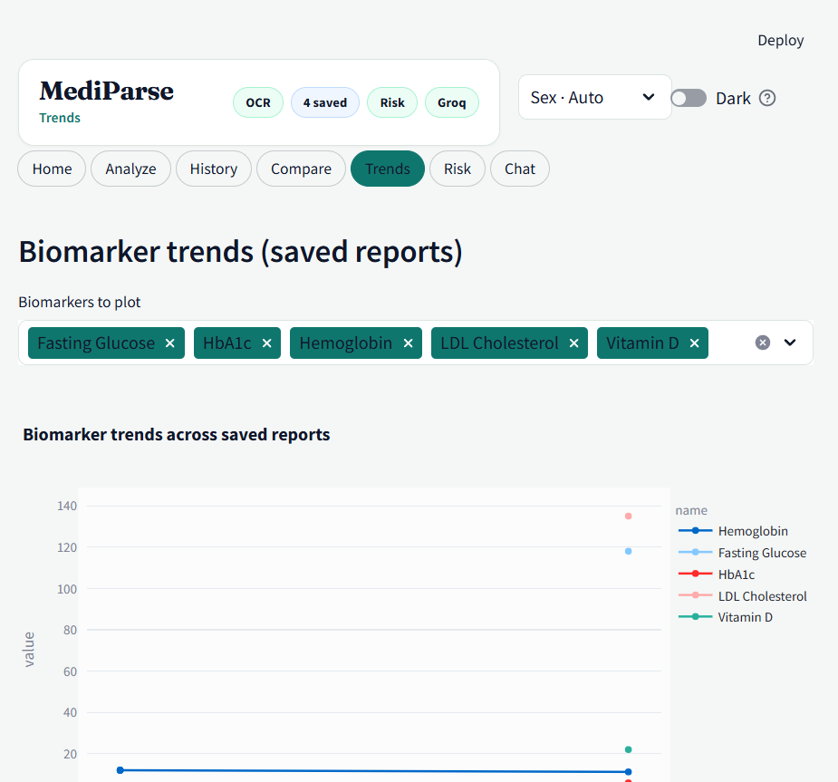
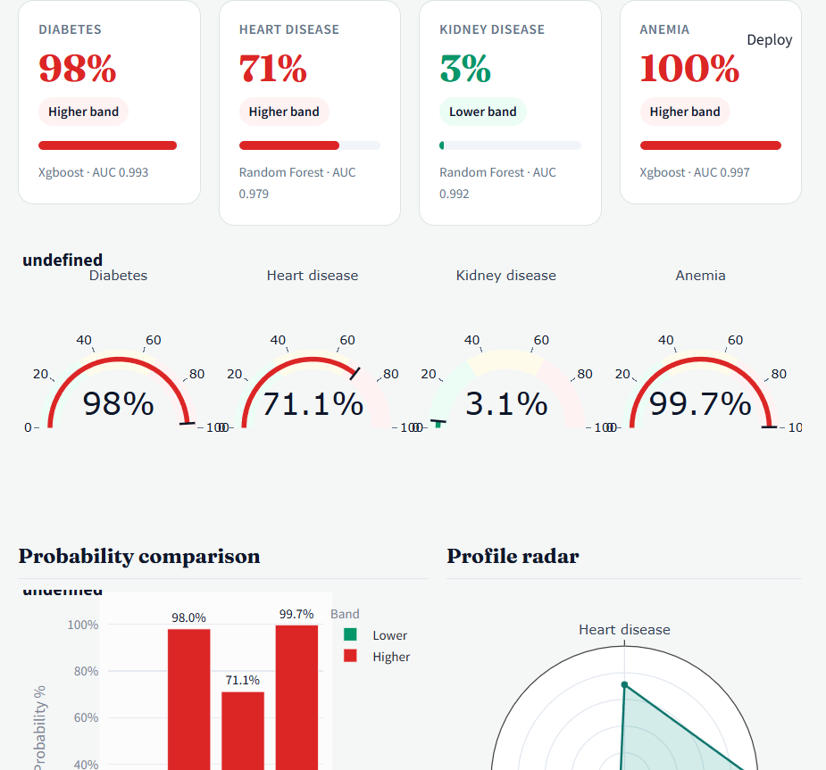
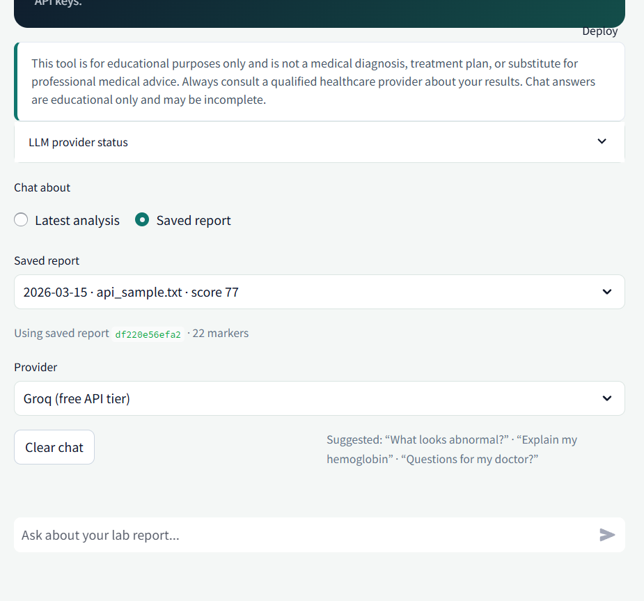

# MediParse — AI Medical Test Report Analyzer

[](https://www.python.org/downloads/)
[](https://streamlit.io)
[](https://fastapi.tiangolo.com)
[](#important-disclaimer)

<div style="background: linear-gradient(90deg, #0f766e 0%, #0b1220 100%); border-radius: 16px; padding: 22px 22px; color: #ffffff; box-shadow: 0 8px 24px rgba(2, 6, 23, 0.25);">
  <div style="font-family: Georgia, 'Times New Roman', Times, serif; font-size: 30px; font-weight: 700; letter-spacing: -0.02em;">MediParse</div>
  <div style="margin-top: 6px; font-size: 16px; opacity: 0.92;">Educational lab-report understanding pipeline for scans & text</div>
  <div style="margin-top: 12px; display: flex; flex-wrap: wrap; gap: 10px;">
    <span style="background: rgba(255,255,255,0.12); border: 1px solid rgba(255,255,255,0.2); border-radius: 999px; padding: 6px 12px; font-weight: 700; font-size: 13px;">OCR → Structured Biomarkers</span>
    <span style="background: rgba(255,255,255,0.12); border: 1px solid rgba(255,255,255,0.2); border-radius: 999px; padding: 6px 12px; font-weight: 700; font-size: 13px;">Explainability-first UX</span>
    <span style="background: rgba(255,255,255,0.12); border: 1px solid rgba(255,255,255,0.2); border-radius: 999px; padding: 6px 12px; font-weight: 700; font-size: 13px;">Trends + Risk (educational)</span>
    <span style="background: rgba(255,255,255,0.12); border: 1px solid rgba(255,255,255,0.2); border-radius: 999px; padding: 6px 12px; font-weight: 700; font-size: 13px;">Clinician PDF export</span>
  </div>
</div>

**MediParse** is a research-style engineering demo: an end-to-end pipeline that converts lab report inputs (PDFs, scans, and pasted text) into structured biomarkers, plain-language explanations, longitudinal trends (history/compare), and educational risk estimates—with clear safety framing and clinician-ready PDF summaries.

The system integrates **Streamlit** (UI), **FastAPI** (REST API), **SQLite** (persistence), **scikit-learn / XGBoost** (ML risk models), and optional free LLM providers (**Ollama**, **Groq**, **Gemini**).

---

## Important disclaimer

> **For learning and portfolio demonstration only.**  
> MediParse is **not** a medical device. It does **not** diagnose, treat, or replace professional medical advice.  
> Reference ranges, explanations, health scores, and risk probabilities are **educational estimates**. Always discuss results with a qualified clinician.  
> Do **not** upload real patient PHI to public or shared deployments.

---

## Table of contents

- [Quick start](#quick-start)
- [About](#about)
- [Problems solved](#problems-solved)
- [Features](#features)
- [Demo workflow](#demo-workflow)
- [Screenshots](#screenshots)
- [UI pages](#ui-pages)
- [Tech stack](#tech-stack)
- [Requirements](#requirements)
- [Installation](#installation)
- [Running the app](#running-the-app)
- [Supported inputs & biomarkers](#supported-inputs--biomarkers)
- [OCR setup](#ocr-setup)
- [Risk models](#risk-models)
- [LLM chat setup](#llm-chat-setup)
- [Clinician PDF export](#clinician-pdf-export)
- [FastAPI backend](#fastapi-backend)
- [Configuration](#configuration)
- [Project structure](#project-structure)
- [Testing](#testing)
- [Architecture](#architecture)
- [Roadmap](#roadmap)
- [Limitations](#limitations)
- [Skills demonstrated](#skills-demonstrated)
- [License](#license)

---

## About

MediParse combines OCR, biomarker parsing, explainable scoring, and lightweight ML risk modeling into a single end-to-end workflow. The project is designed for learning, portfolio demonstration, and interface research on how laboratory results can be transformed into readable, structured educational artifacts.

**Core design goals:**

1. Reduce information friction: extract values from scans and PDFs, then normalize them to known biomarker keys.
2. Improve interpretability: show reference-range-aware statuses and marker-level human explanations.
3. Support longitudinal reasoning: compare and trend biomarkers across saved analyses.
4. Keep safety boundaries explicit: educational outputs only, with clinician PDF summaries for discussion.

## Problems solved

MediParse targets practical gaps in lab-report understanding workflows:

- **Scan/PDF usability problem:** OCR + PDF extraction turn unstructured documents into structured marker/value records.
- **Normalization & parsing problem:** alias-aware biomarker detection handles OCR noise and lab naming variations.
- **Comprehension problem:** marker-level explanations, educational health scoring, and risk bands translate results into understandable narratives.
- **Longitudinal insight problem:** SQLite persistence enables History, Compare, and Trends so users can observe changes over time.
- **Integration & deployment problem:** FastAPI exposes REST endpoints for analyze, history, risk, chat, and PDF export.

## Research Contributions

This project contributes an end-to-end, explainability-first pipeline for transforming laboratory data into educational artifacts:

- **OCR-to-biomarker normalization:** robust alias mapping to reduce OCR and formatting variance.
- **Interpretability layer:** reference-range-aware status flags and marker-level plain-language explanations.
- **Longitudinal study interface:** persisted histories with compare/delta and biomarker trend visualization.
- **Educational risk modeling:** interpretable risk bands using supervised ML models (portfolio/demo dataset).
- **Deployment-ready architecture:** shared analyze pipeline exposed through a FastAPI REST API + clinician PDF generation.

## Quick start

```bash
git clone <your-repo-url> medical-report-analyzer
cd medical-report-analyzer

python -m venv .venv

# Windows PowerShell
.\.venv\Scripts\activate

# macOS / Linux
# source .venv/bin/activate

pip install -r requirements.txt
python scripts/train_risk_models.py

streamlit run app.py
```

Open **http://localhost:8501**.

Optional API:

```bash
uvicorn api.main:app --reload --port 8000
# Docs → http://localhost:8000/docs
```

---

## Features

### Analyze & explain

| Capability | Description |
| --- | --- |
| **Multi-format upload** | PDF, PNG, JPG, or pasted text |
| **Text extraction** | `pdfplumber` for digital PDFs; **RapidOCR** for images/scanned pages; optional Tesseract fallback |
| **Biomarker parsing** | 20+ common labs with alias matching (handles OCR quirks) |
| **Reference ranges** | Sex-aware thresholds from `data/reference_ranges.json` |
| **Status flags** | Normal · borderline · low · high |
| **Plain-language explanations** | Patient-friendly text per marker |
| **Educational health score** | 0–100 score + category snapshot |
| **Summaries** | Patient summary + clinician-oriented narrative |
| **Sample reports** | Baseline + follow-up demos in `samples/` |

### Persistence & trends

| Capability | Description |
| --- | --- |
| **SQLite database** | Auto-save to `data/reports.db` on analyze |
| **History** | Browse, open, export JSON, delete single/bulk/all |
| **Compare** | Side-by-side previous vs current report with delta chart |
| **Trends** | Line charts for biomarkers and health score over time |

### Educational risk estimation

| Capability | Description |
| --- | --- |
| **Four risk models** | Diabetes · heart disease · kidney disease · anemia |
| **Algorithms** | Random Forest + XGBoost; best holdout AUC saved per condition |
| **Explainability** | Feature importance + per-condition narrative |
| **Context inputs** | Age, BMI, systolic BP, sex (optional) |
| **Data sources** | Latest analysis, saved report, or manual entry |

> Models are trained on **synthetic educational cohorts** — not clinically validated.

### Chat with your report

| Capability | Description |
| --- | --- |
| **Grounded Q&A** | Answers scoped to extracted lab context |
| **Ollama** | Free local LLM (e.g. `llama3.2`) |
| **Groq / Gemini** | Free API tiers via env vars or Streamlit secrets |
| **Offline helper** | Rule-based fallback when no LLM is configured |
| **Safety framing** | No diagnosis or prescription; encourages clinician follow-up |

### Export & API

| Capability | Description |
| --- | --- |
| **Clinician PDF** | Structured PDF via ReportLab |
| **PDF download** | From Analyze results and History |
| **FastAPI backend** | REST API for analyze, reports, risk, chat, PDF |
| **OpenAPI docs** | Swagger UI at `/docs` |

### UI

| Capability | Description |
| --- | --- |
| **Top navbar** | Home · Analyze · History · Compare · Trends · Risk · Chat |
| **Status chips** | OCR · saved count · risk models · active LLM |
| **Sex selector** | Auto / Female / Male for reference ranges |
| **Light / dark mode** | Theme toggle in the navbar |
| **Clinical branding** | Fraunces + Source Sans 3, teal/slate palette |

---

## Demo workflow

Recommended 5-minute portfolio walkthrough:

1. **Home** → **Analyze a report**
2. **Analyze** → **Try sample** → **Load baseline sample** → **Analyze & save**
3. Review biomarker table, explanations, health score → download clinician PDF
4. **Risk** → **Latest analysis** → **Estimate risks**
5. **Analyze** again → **Load follow-up sample** → **Analyze & save**
6. **Compare** → baseline vs follow-up
7. **Trends** → glucose, HbA1c, hemoglobin, LDL, vitamin D
8. **Chat** → *"Which values improved?"* or *"Explain my LDL result"*

---

## Screenshots

<p align="center">
  
</p>

| Home / Analyze | History / Compare |
| --- | --- |
|  |  |
|  |  |

| Trends / Risk | Chat |
| --- | --- |
|  |  |
|  | |

All images live in [`docs/screenshots/`](docs/screenshots/).

## UI pages

| Page | Purpose |
| --- | --- |
| **Home** | Product overview, quick-start CTAs, workspace status |
| **Analyze** | Upload / paste / sample → OCR preview → edit text → analyze & save |
| **History** | Saved reports, detail view, JSON/PDF export, delete |
| **Compare** | Two-report diff table + value-change chart |
| **Trends** | Multi-marker line charts + score over time |
| **Risk** | Context form, risk cards, gauges, radar, feature importance |
| **Chat** | Provider selector, conversation history, suggested prompts |

---

## Tech stack

| Layer | Tools |
| --- | --- |
| **UI** | Streamlit 1.32+, custom CSS, Plotly |
| **API** | FastAPI, Uvicorn, Pydantic |
| **OCR / PDF** | RapidOCR (ONNX), pdfplumber, pdf2image, Pillow, optional Tesseract |
| **Data** | pandas, SQLite |
| **ML** | scikit-learn, XGBoost, joblib |
| **LLM** | httpx → Ollama / Groq / Gemini |
| **PDF export** | ReportLab |

---

## Requirements

- **Python** 3.10+ (3.11 recommended)
- **pip** and **venv**
- **~2 GB disk** (venv + ONNX OCR models on first run)
- **Optional:** [Tesseract OCR](https://github.com/UB-Mannheim/tesseract/wiki)
- **Optional:** [Ollama](https://ollama.com) for local LLM chat
- **Optional:** Groq or Gemini API keys for cloud LLM chat

> Prefer the project venv when running Streamlit. System-wide older Streamlit builds may lack newer widget APIs.

---

## Installation

```bash
cd medical-report-analyzer

python -m venv .venv

# Windows PowerShell
.\.venv\Scripts\activate

# macOS / Linux
# source .venv/bin/activate

pip install -r requirements.txt

# Required for Risk page + /risk/estimate API
python scripts/train_risk_models.py
```

First OCR run may download RapidOCR ONNX weights automatically.

---

## Running the app

### Streamlit UI (primary)

```bash
.\.venv\Scripts\activate   # Windows — always activate first
streamlit run app.py
```

Default URL: **http://localhost:8501**

### FastAPI backend (optional)

```bash
.\.venv\Scripts\activate
uvicorn api.main:app --reload --port 8000
```

| URL | Purpose |
| --- | --- |
| http://localhost:8000/docs | Swagger UI |
| http://localhost:8000/redoc | ReDoc |
| http://localhost:8000/health | Health check |

UI (8501) and API (8000) can run at the same time.

---

## Supported inputs & biomarkers

### Input formats

| Format | Method |
| --- | --- |
| **Plain text** | Paste or `.txt` upload |
| **PDF (text layer)** | `pdfplumber` |
| **PDF (scanned)** | Per-page OCR fallback |
| **PNG / JPG** | RapidOCR (primary) |

Edit extracted text in **Analyze** before running analysis.

### Parsed biomarkers (20+)

Defined in `data/reference_ranges.json` (23 marker keys):

| Category | Markers |
| --- | --- |
| **Iron / blood count** | Hemoglobin, hematocrit, RBC, WBC, platelets, iron, ferritin |
| **Blood sugar** | Fasting glucose, random glucose, HbA1c |
| **Heart / lipids** | Total cholesterol, LDL, HDL, triglycerides |
| **Kidney** | Creatinine, BUN, eGFR |
| **Liver** | ALT, AST, total bilirubin |
| **Vitamins** | Vitamin D, vitamin B12 |
| **Thyroid** | TSH |

Each marker supports multiple **aliases** (e.g. *FBS*, *fasting blood sugar*) to survive OCR noise and lab naming variations.

---

## OCR setup

### Default — RapidOCR

Included in `requirements.txt`. No system Tesseract needed for PNG/JPG.

```bash
pip install rapidocr-onnxruntime onnxruntime
```

Test with **Analyze → Try sample → OCR sample PNG** (`samples/sample_blood_report.png`).

OCR readiness appears as a status chip in the top navbar.

### Optional — Tesseract

1. Install Tesseract for your OS  
2. Ensure `tesseract` is on `PATH` (Windows default paths are auto-detected)  
3. Use as fallback when RapidOCR is unavailable

### Tips

- Prefer high-contrast scans at **300 DPI+**
- Always review the **Extracted text** box before analyzing
- For messy multi-column layouts, paste text manually if OCR order is wrong

---

## Risk models

### Train

```bash
python scripts/train_risk_models.py
```

Artifacts written to `models/`:

```text
models/
├── diabetes_model.joblib   + diabetes_meta.json
├── heart_model.joblib      + heart_meta.json
├── kidney_model.joblib     + kidney_meta.json
├── anemia_model.joblib     + anemia_meta.json
└── training_summary.json
```

### Model inputs

| Condition | Key biomarkers | Extra inputs |
| --- | --- | --- |
| **Diabetes** | Fasting glucose, HbA1c, random glucose, triglycerides | Age, BMI |
| **Heart** | Total cholesterol, LDL, HDL, triglycerides, fasting glucose | Age, BMI, systolic BP |
| **Kidney** | Creatinine, BUN, eGFR, fasting glucose, hemoglobin | Age |
| **Anemia** | Hemoglobin, hematocrit, RBC, iron, ferritin | Age, sex |

**Risk bands (educational):** Lower (&lt;33%) · Moderate (33–66%) · Higher (&gt;66%).

Missing biomarkers are imputed from training medians (shown in results).

---

## LLM chat setup

MediParse works without any LLM (offline helper). For richer answers, configure one provider.

### Option A — Ollama (free, local)

```bash
# Install from https://ollama.com
ollama pull llama3.2
ollama serve
```

Default host: `http://localhost:11434`  
Override with `OLLAMA_HOST` / `OLLAMA_MODEL`.

### Option B — Groq (free API tier)

1. Create a key at [console.groq.com](https://console.groq.com)  
2. Add it to Streamlit secrets (recommended) or set an env var:

```bash
# Windows PowerShell
$env:GROQ_API_KEY="gsk_..."

# macOS / Linux
export GROQ_API_KEY=gsk_...
```

### Option C — Google Gemini (free API tier)

1. Create a key in [Google AI Studio](https://aistudio.google.com/)  
2. Set `GEMINI_API_KEY` (env or secrets)

### Streamlit secrets (recommended)

```bash
# Windows
copy .streamlit\secrets.toml.example .streamlit\secrets.toml

# macOS / Linux
# cp .streamlit/secrets.toml.example .streamlit/secrets.toml
```

```toml
# .streamlit/secrets.toml  (gitignored — never commit real keys)
GROQ_API_KEY = "gsk_..."
# GEMINI_API_KEY = "..."
# OLLAMA_HOST = "http://localhost:11434"
# OLLAMA_MODEL = "llama3.2"
```

The **Chat** page lists detected providers. The navbar shows the active LLM chip (e.g. Groq) or Offline.

---

## Clinician PDF export

Includes:

- Report metadata (date, sex, filename, health score)
- Biomarker table with status flags
- Patient and clinician narrative summaries
- Educational disclaimer footer

**Streamlit:** download from Analyze results and History detail.  
**API:** `GET /reports/{id}/export.pdf` or `POST /export/pdf`.

---

## FastAPI backend

### Endpoints

| Method | Path | Description |
| --- | --- | --- |
| `GET` | `/health` | Status, report count, OCR / LLM / risk availability |
| `POST` | `/analyze/text` | Analyze pasted report text |
| `POST` | `/analyze/upload` | Upload file → OCR → analyze |
| `GET` | `/reports` | List saved reports |
| `GET` | `/reports/{id}` | Full report detail |
| `DELETE` | `/reports/{id}` | Delete a report |
| `GET` | `/reports/{id}/export.json` | Download report JSON |
| `GET` | `/reports/{id}/export.pdf` | Download clinician PDF |
| `POST` | `/export/pdf` | Build PDF from marker payload |
| `POST` | `/risk/estimate` | Run all four risk models |
| `POST` | `/chat` | Ask a question about a report |

### Examples

```bash
# Analyze text
curl -X POST http://localhost:8000/analyze/text \
  -H "Content-Type: application/json" \
  -d "{\"text\": \"Fasting Glucose: 105 mg/dL\\nHbA1c: 5.8%\", \"sex\": \"female\", \"save\": true}"

# Upload file
curl -X POST "http://localhost:8000/analyze/upload?sex=auto&save=true" \
  -F "file=@samples/sample_blood_report.txt"

# Risk estimate
curl -X POST http://localhost:8000/risk/estimate \
  -H "Content-Type: application/json" \
  -d "{
    \"markers\": [{\"key\": \"glucose_fasting\", \"value\": 110}],
    \"age\": 45,
    \"bmi\": 26,
    \"systolic_bp\": 128,
    \"sex\": \"female\"
  }"

# Chat
curl -X POST http://localhost:8000/chat \
  -H "Content-Type: application/json" \
  -d "{
    \"question\": \"What does an elevated LDL mean educationally?\",
    \"markers\": [{\"key\": \"ldl\", \"value\": 145, \"status\": \"high\"}],
    \"provider\": \"Offline helper (no API key)\"
  }"
```

---

## Configuration

| File | Purpose |
| --- | --- |
| `.streamlit/config.toml` | Default light Streamlit theme (teal primary) |
| `.streamlit/secrets.toml` | API keys (gitignored — copy from `secrets.toml.example`) |
| `data/reference_ranges.json` | Biomarker thresholds, aliases, explanations |
| `data/reports.db` | SQLite database (created on first run, gitignored) |
| `models/*.joblib` | Trained risk classifiers |

### Environment variables

| Variable | Default | Description |
| --- | --- | --- |
| `GROQ_API_KEY` | — | Groq API key |
| `GEMINI_API_KEY` | — | Google Gemini API key |
| `OLLAMA_HOST` | `http://localhost:11434` | Ollama server URL |
| `OLLAMA_MODEL` | `llama3.2` | Ollama model name |
| `GROQ_MODEL` | `llama-3.1-8b-instant` | Groq model override |
| `GEMINI_MODEL` | `gemini-2.0-flash` | Gemini model override |

---

## Project structure

```text
medical-report-analyzer/
├── app.py                         # Streamlit UI (MediParse)
├── requirements.txt
├── README.md
├── api/
│   └── main.py                    # FastAPI application
├── data/
│   ├── reference_ranges.json      # Biomarker definitions
│   └── reports.db                 # SQLite (runtime, gitignored)
├── models/                        # Risk model artifacts
├── docs/
│   └── screenshots/               # UI screenshots for README
├── samples/
│   ├── sample_blood_report.txt
│   ├── sample_blood_report_followup.txt
│   └── sample_blood_report.png
├── scripts/
│   ├── train_risk_models.py
│   ├── smoke_test.py              # Phase 1 pipeline
│   ├── smoke_test_phase2.py
│   ├── smoke_test_phase3.py
│   ├── smoke_test_phase5.py       # API + PDF
│   └── generate_sample_png.py
├── exports/                       # Generated PDFs (gitignored)
├── .streamlit/
│   ├── config.toml
│   └── secrets.toml.example
└── src/
    ├── ocr/extractor.py
    ├── parsing/
    │   ├── biomarkers.py
    │   └── reference_ranges.py
    ├── analysis/
    │   ├── status.py
    │   ├── health_score.py
    │   └── explanations.py
    ├── db/
    │   ├── database.py
    │   └── repository.py
    ├── ml/
    │   ├── features.py
    │   └── predict.py
    ├── llm/
    │   ├── providers.py
    │   └── chat.py
    ├── export/pdf_report.py
    ├── services/pipeline.py
    └── utils/
```

---

## Testing

```bash
python scripts/smoke_test.py          # parsing, status, health score
python scripts/smoke_test_phase2.py   # SQLite save / list / compare
python scripts/smoke_test_phase3.py   # risk model inference
python scripts/smoke_test_phase5.py   # PDF + FastAPI routes
```

Expected Phase 1: ≥10 biomarkers from sample, mixed status flags, health score roughly 40–95.

---

## Architecture

```text
                 ┌──────────────────────────────────────┐
                 │     Streamlit UI (app.py)             │
                 │  Top navbar · Analyze · Risk · Chat   │
                 └──────────────────┬───────────────────┘
                                    │
                 ┌──────────────────▼───────────────────┐
                 │     src/services/pipeline.py          │
                 │  parse → analyze → score → summarize  │
                 └──────────────────┬───────────────────┘
       ┌────────────────────────────┼────────────────────────────┐
       ▼                            ▼                            ▼
 src/ocr/extractor          src/parsing/biomarkers        src/analysis/*
       │                            │                            │
       └────────────────────────────┴────────────────────────────┘
                                    │
                 ┌──────────────────▼───────────────────┐
                 │      src/db/repository.py (SQLite)    │
                 └──────────────────┬───────────────────┘
       ┌────────────────────────────┼────────────────────────────┐
       ▼                            ▼                            ▼
 src/ml/predict.py           src/llm/chat.py            src/export/pdf_report.py
 (RF / XGBoost)              (Ollama/Groq/Gemini)       (ReportLab)

                 ┌──────────────────────────────────────┐
                 │       FastAPI (api/main.py)           │
                 │   Same pipeline via REST endpoints    │
                 └──────────────────────────────────────┘
```

---

## Roadmap

| Phase | Feature | Status |
| --- | --- | --- |
| **1** | Upload · OCR · Extract · Explain · Score | ✅ Done |
| **2** | SQLite · History · Compare · Trends | ✅ Done |
| **3** | Risk models + explainability dashboard | ✅ Done |
| **4** | LLM chat (Ollama / Groq / Gemini) | ✅ Done |
| **5** | Clinician PDF + FastAPI | ✅ Done |
| **6** | Multilingual UI + voice explanations | 🔜 Planned |
| **7** | Docker deploy (Render / Railway / Streamlit Cloud) | 🔜 Planned |

---

## Limitations

- **Not clinically validated** — reference ranges are simplified educational defaults  
- **OCR accuracy** varies with scan quality; always review extracted text  
- **Risk models** use synthetic training data for demo purposes only  
- **LLM answers** may hallucinate; offline helper is rule-based and limited  
- **No HIPAA compliance** — do not upload real patient PHI in public deployments  
- **No user authentication** — single-user local / portfolio use assumed  
- **English-first** — multilingual support planned for Phase 6  

---

## Skills demonstrated

Data preprocessing · OCR · information extraction · reference-range analytics · explainable patient messaging · interactive visualization · Streamlit UX · SQLite persistence · time-series trends · supervised ML (Random Forest / XGBoost) · model explainability · LLM integration · REST API design · PDF report generation · healthcare analytics literacy

---

## License

Educational / portfolio use only. **Not licensed for clinical deployment.**

If you extend this for research or production, add regulatory review, validation datasets, privacy controls, and clinician oversight before handling real patient data.

---

## Quick reference

```bash
cd medical-report-analyzer
python -m venv .venv && .\.venv\Scripts\activate
pip install -r requirements.txt
python scripts/train_risk_models.py

streamlit run app.py
uvicorn api.main:app --reload --port 8000

python scripts/smoke_test.py
```

**URLs:** UI → http://localhost:8501 · API docs → http://localhost:8000/docs
